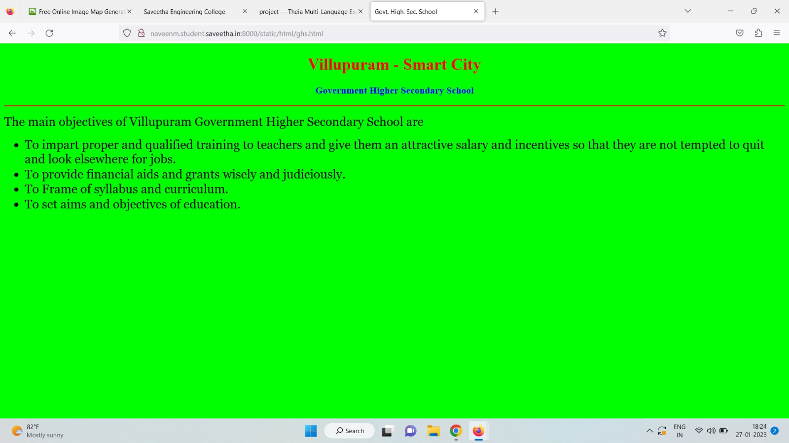
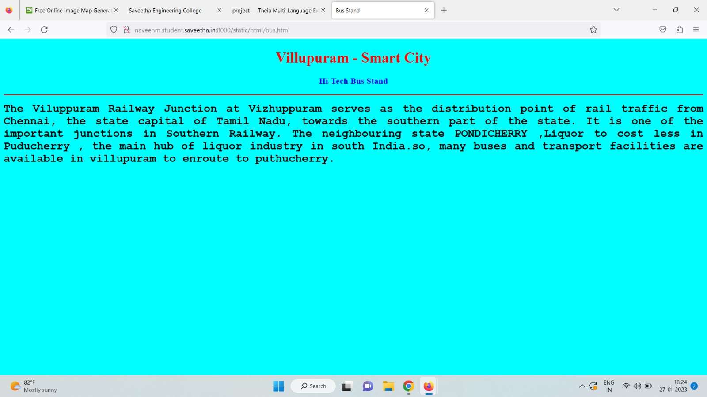
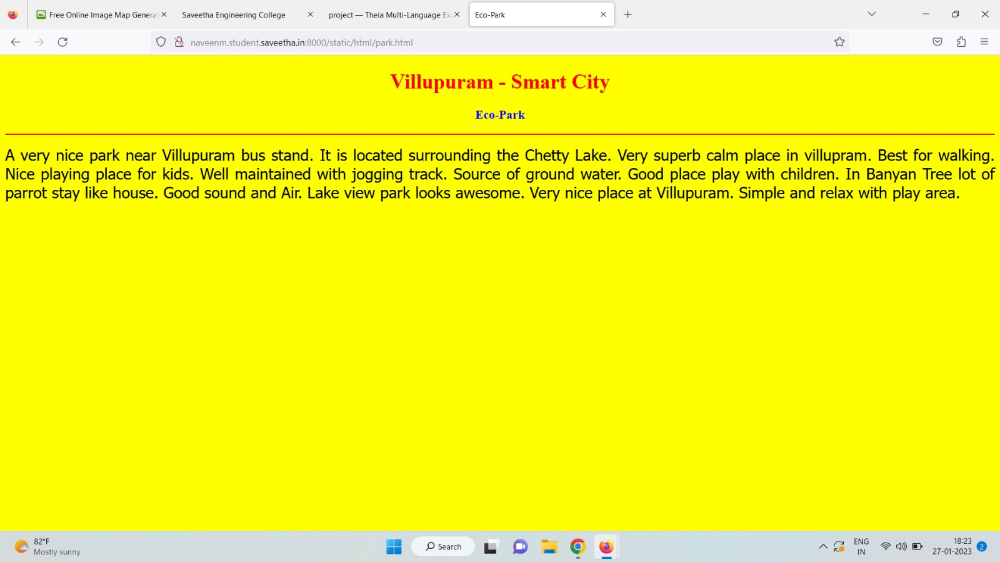
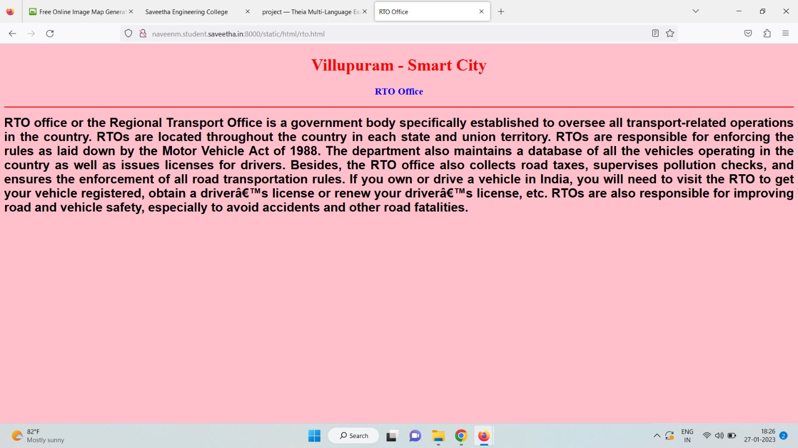
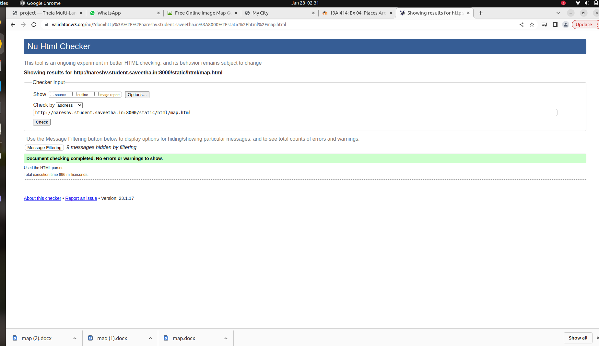

# Places Around Me
## AIM:
To develop a website to display details about the places around my house.

## Design Steps:

### Step 1:
Clone the github repository into Thea IDE

### Step 2:
Create a new Django project

### Step 3:
Write the needed HTML Code.

### Step 4:
Run the django Server and execute the HTML files.

### Step 2:
## Code:
```
map.html 
<!DOCTYPE html>
<html lang="en">
<head>
<title>My City</title>
</head>
<body>
<h1 align="center">
<font color="red"><b>villupuram - Smart City</b></font>
</h1>
<h3 align="center">
<font color="blue"><b>NARESHVB (22008873)</b></font>
</h3>
<center>
<!-- Image Map Generated by http://www.image-map.net/ -->


<map name="image-map">
    <area target="" alt="railwaystation" title="railwaystation" href="" coords="713,396,906,612" shape="rect">
    <area target="" alt="lake" title="lake" href="" coords="964,51,1364,292" shape="rect">
</map>
</center>
</body>
</html>

railwaystation.html
<!DOCTYPE html>
<html lang="en">
<head>
<title>railway station</title>
</head>
<body bgcolor="cyan">
<h1 align="center">
<font color="red"><b>Villupuram - Smart City</b></font>
</h1>
<h3 align="center">
<font color="blue"><b>Railway station</b></font>
</h3>
<hr size="3" color="red">
<p align="justify">
<font face="Courier New" size="5">
<b>
Villupuram district is an administrative district, one of the 38 districts in the 
state of Tamil Nadu in India. The district headquarters is located at Villupuram. 
The district encompasses an area of 1,949.31 km², is a UNESCO World Heritage site 
situated in this district. The district is also known for its rich prehistoric 
fossils. Many fossils of gigantic molluscs and jawed fishes, at least one 
fossilized dinosaur egg, and several fragmentary fossils of sauropod and theropod 
dinosaurs have been discovered here. An on-site museum is being set up at 
valavanur to preserve and conserve fossils. Villupuram is noted for its smart
 industries and city.
</b>
</font>
</p>
</body>
</html>

lake.html
<!DOCTYPE html>
<html lang="en">
<head>
<title>Washerman’s Lake</title>
</head>
<body bgcolor="orange">
<h1 align="center">
<font color="red"><b>Villupuram - Smart City</b></font>
</h1>
<h3 align="center">
<font color="blue"><b>Washerman's Lake</b></font>
</h3>
<hr size="3" color="red">
<p align="justify">
<font face="Georgia" size="5">
The uses of Washerman's Lake in Villupuram District are 
<ol type="1">
<li>Lake is used for rain water harvesting.</li>
<li>It is used for drinking.</li>
<li>Pisculture.</li>
<li>For bathing, washing clothes etc.</li>
</ol>
</font>
</p>
</body>
</html>

park.html
<!DOCTYPE html>
<html lang="en">
<head>
<title>Eco-Park</title>
</head>
<body bgcolor="yellow">
<h1 align="center">
<font color="red"><b>Villupuram - Smart City</b></font>
</h1>
<h3 align="center">
<font color="blue"><b>Eco-Park</b></font>
</h3>
<hr size="3" color="red">
<p align="justify">
<font face="Tahoma" size="5">
A very nice park near Villupuram bus stand. It is located surrounding the Chetty Lake. 
Very superb calm place in Villupuram. Best for walking. Nice playing place for kids.
Well maintained with jogging track. Source of ground water.
Good place play with children.  In Banyan Tree lot of parrot stay like house. 
Good sound and Air. Lake view park looks awesome.
Very nice place at Ariyalur.
Simple and relax with play area.
</font>
</p>
</body>
</html>


```

## Output:








## HTML Validator:


## Result:
The Program for implementing a image map is executed successfully.
